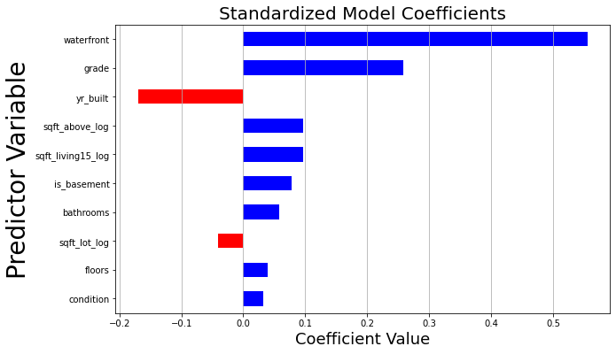
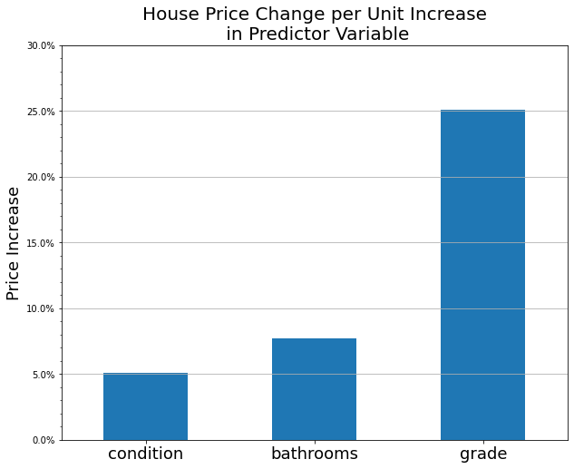

# Housing Price Linear Regression Analysis


**Author:** Benjamin Toler

## Overview
This project uses linear regression analysis to infer how certain variables impact housing prices and by how much. Analysis of data from King County House Sales shows that house condition, grade, and bathroom number are three key features that can increase a house's price. Any home seller can use this information to make decisions on potential renovations.

## Business Problem
A real estate agency is looking to guide homeowners who are looking to sell their houses. They want to provide these homeowners with analysis of how renovations may impact the price of their home.

## Data
This project uses 2014-2015 data from the King County House Sales dataset. It includes information on over 21,000 houses describing features such as age, size, condition, etc.

## Method
The analysis deployed in this project uses multiple linear regression methods to develop a model of house price using a subset of predictor variables. Several variables were log transformed, and all non-binary variables were standardized. Model iterations were compared by r-squared score.

## Results
The final model has a r-squared score of 0.65, meaning that 65% of the variance in the dataset is described by the model.

The final model included 10 predictor variables. Of those, waterfront, house grade, and year built were the three most significant predictors of house price.



Of the three features that can be affected by renovations, grade has the highest impact, increasing price by nearly 25% for every one-unit increase. A one-bathroom increase results in a 7.7% increase in price, and a one unit increase in condition increases price by about 5%.



## Conclusions
- **Homeowners should invest in the maintenance and repair of worn out house features:** maintaining and repairing house features such as paint, roofing, plumbing, etc. to improve overall house condition can increase of house's sale price.
- **Add a full or half bathroom to an existing unused area in the house:** an additional full bathroom in a house can increase the price by about 8.6%. According to homeadvisor, the average cost of a new bathroom is about $1500, so for any house currently priced at $200,000 or more, adding a new bathrooms presents a good return on investment
- **Home owners with larger budgets should invest in construction and design upgrades:** improving a house's grade by updating to higher quality materials and features and improving design aspects can increase a house price by nearly 25% per unit grade increase.

## Next Steps
- **Search for addition data to add to model to improve prediction accuracy:** the r-squared value of 0.65 is not ideal for use in predicting price. Adding additional data not included in this dataset may improve the accuracy.
- **Determine what design attributes most improve house grade:** housing grade is the second strongest predictor of house price, and is partly determined by the design and construction quality of the house. Knowing what defines quality design will be helpful in making more specific recommendations.
- **Look at how location within King County affects house price:** this model did not include latitude and longitude. Including some metric for location in a future model may impact the relative importance of other predictor variables.

## For More Information

See the full analysis in the [Jupyter Notebook](./Housing_Renovation_Analysis.ipynb) or review this [presentation](./presentation.pdf).

For additional info, contact Benjamin Toler at [bentoler22@gmail.com](mailto:alison.bentoler22@gmail.com)


## Repository Structure

```
├── images
├── data
├── .canvas
├── .gitignore
├── CONTRIBUTING.md
├── LICENSE.md
└── HOsuing_Renovation_Analysis.ipynb
├── README.md
├── presentation.pdf
```
